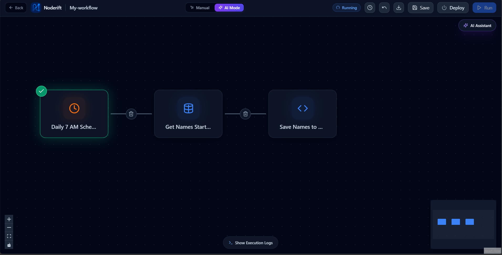

# Noderift

AI-powered visual workflow automation platform. Build, orchestrate, and execute automation pipelines using an interactive DAG canvas and natural language AI planning.



---

## ⚡ Editions

| Edition | Description | Access |
|---|---|---|
| **Cloud** | Hosted version with managed AI routing, instant OAuth integrations, and zero setup. | [app.noderift.fun](https://app.noderift.fun) |
| **Open Source** | Self-hosted on your own infrastructure with Docker. Bring your own keys and retain full data control. | Self-host via GitHub |

---

## 🚀 Quick Start (Self-Hosted)

### Prerequisites
- [Docker](https://docs.docker.com/get-docker/) & Docker Compose

### 1. Run with Docker (One-Liner)
```bash
curl -O https://raw.githubusercontent.com/Iconic-Aman/Noderift/main/docker-compose.yml && docker compose up -d
```

*Or via Git clone:*
```bash
git clone https://github.com/Iconic-Aman/Noderift.git
cd Noderift && docker compose up -d
```

All services (PostgreSQL, Redis, and Noderift) initialize automatically with zero manual setup.

### 2. Open & Add Keys in UI
- Visit `http://localhost:3000` in your browser.
- Go to the **Credentials** page to configure your OpenRouter, Resend, or database keys directly in the UI.

---

## 🧠 AI Models & Dynamic Fallback

Noderift utilizes an automated multi-model fallback chain via OpenRouter with LangGraph self-correcting agents:

1. **`OPENROUTER_MODEL`** — Primary lightweight code & workflow generation model (`cohere/north-mini-code:free`).
2. **`OPENROUTER_MODEL1`** — High-reasoning heavy builder model (`meta-llama/llama-3.3-70b-instruct`).
3. **`OPENROUTER_MODEL2`** — Free-tier coding fallback (`qwen/qwen3-coder:free`).
4. **`OPENROUTER_MODEL3`** — Auxiliary fallback model (`poolside/laguna-xs-2.1:free`).

If a model encounters provider downtime, rate-limiting, or guardrail validation errors, Noderift automatically falls back to the next model in the sequence.

---

## ✨ Key Capabilities

- **Interactive Visual Canvas:** React Flow-powered DAG workflow builder with smooth zoom, pan, real-time node drag & drop, and topological execution.
- **Natural Language AI Planner:** Describe what you want to automate in chat, and the agent constructs, configures, and connects the pipeline nodes automatically.
- **Database Integrations:** Native queries for PostgreSQL, MySQL, and MongoDB with dynamic output mapping.
- **Python Code Execution:** In-browser Python node with pandas, JSON parsing, and automatic Excel (`.xlsx`) report generation and download.
- **Triggers & Scheduling:** Webhook endpoints and Cron schedules with automated background task sync.
- **Communication & Email:** Resend, Gmail OAuth, and Slack integrations for alerting and notifications.
- **Execution Tracing:** Real-time WebSocket logging, per-node duration tracking, and step-by-step trace inspection.

---

## 📄 License & Legal

- **License:** Open-source under the repository license.
- **Legal:** [Privacy Policy](privacy-policy.md) • [Terms of Service](terms-of-service.md)
