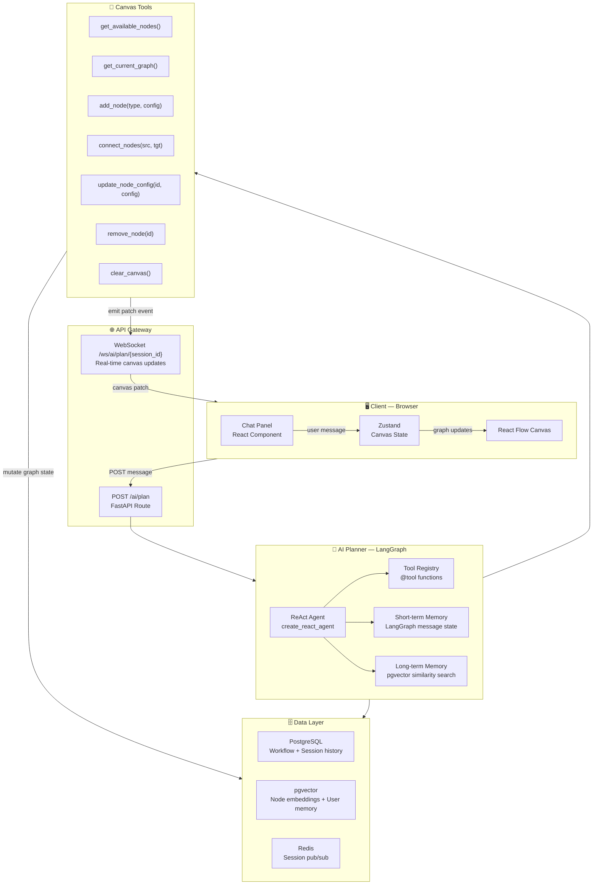
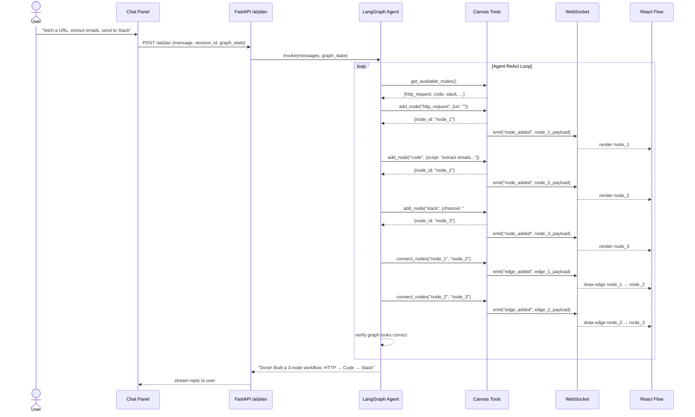

# Noderift — AI Planner Agent Design

> The AI brain behind Noderift's canvas. Understands natural language, builds workflows autonomously, wires node dependencies, and accepts follow-up edits — all without the user touching the canvas.

---

## 1. What Is the AI Planner?

The AI Planner is a **LangGraph ReAct agent** that acts as the "Cursor for your canvas." It receives a natural language prompt from the user, decides which tools to call, calls them in sequence, and the canvas updates in real-time via WebSocket.

It is **not** the same as `AiAgentNode` (Phase 6). That's a node that executes at runtime. The Planner is a layer above — it **designs** the workflow before execution ever starts.

| | AI Planner | AiAgentNode |
|---|---|---|
| **Job** | Design the workflow | Execute as a node at runtime |
| **When** | Before execution | During execution |
| **Tools** | Canvas manipulation tools | Noderift nodes as tools |
| **Analogy** | Cursor writing code | The code running |

---

## 2. High-Level Architecture



---

## 3. Agent Loop — How It Works

Every user message goes through this loop. The agent keeps calling tools until it decides it's done, then replies.



---

## 4. Tool Definitions

All tools are Python functions decorated with `@tool` (LangChain). They mutate a shared `GraphState` object held in the session.

```python
# backend/ai/planner/tools.py

from langchain_core.tools import tool
from typing import Any
import uuid

@tool
def get_available_nodes() -> list[dict]:
    """
    Returns all node types registered in Noderift.
    Use this first to know what nodes you can add.
    """
    from backend.nodes.registry import NODE_REGISTRY
    return [
        {
            "type": node.node_type,
            "display_name": node.display_name,
            "description": node.description,
            "input_schema": node.input_schema.schema(),
            "output_schema": node.output_schema.schema(),
        }
        for node in NODE_REGISTRY.values()
    ]


@tool
def get_current_graph(session_id: str) -> dict:
    """
    Returns the current nodes and edges on the canvas.
    Call this before making edits to understand what already exists.
    """
    from backend.ai.planner.session import get_session_graph
    return get_session_graph(session_id)


@tool
def add_node(session_id: str, node_type: str, label: str, config: dict) -> dict:
    """
    Add a node to the canvas.
    Returns the node_id — save it to use in connect_nodes later.

    Args:
        node_type: Must be a valid type from get_available_nodes()
        label: Human-readable name shown on the canvas
        config: Node-specific configuration (url, script, channel etc.)
    """
    node_id = f"node_{uuid.uuid4().hex[:8]}"
    node = {
        "id": node_id,
        "type": node_type,
        "data": {"label": label, "config": config},
        "position": _next_position(session_id),
    }
    _patch_graph(session_id, "add_node", node)
    return {"node_id": node_id, "status": "added"}


@tool
def connect_nodes(session_id: str, source_id: str, target_id: str) -> dict:
    """
    Connect two nodes with a directed edge.
    Data flows from source → target.
    Always call this after adding nodes to wire dependencies.

    Args:
        source_id: node_id of the upstream node (produces output)
        target_id: node_id of the downstream node (consumes input)
    """
    edge_id = f"edge_{source_id}_{target_id}"
    edge = {"id": edge_id, "source": source_id, "target": target_id}
    _patch_graph(session_id, "add_edge", edge)
    return {"edge_id": edge_id, "status": "connected"}


@tool
def update_node_config(session_id: str, node_id: str, config: dict) -> dict:
    """
    Update the configuration of an existing node.
    Use this when the user asks to change a node's settings.

    Args:
        node_id: ID of the node to update
        config: Partial or full config dict to merge into existing config
    """
    _patch_graph(session_id, "update_node", {"id": node_id, "config": config})
    return {"node_id": node_id, "status": "updated"}


@tool
def remove_node(session_id: str, node_id: str) -> dict:
    """
    Remove a node and all its connected edges from the canvas.
    """
    _patch_graph(session_id, "remove_node", {"id": node_id})
    return {"node_id": node_id, "status": "removed"}


@tool
def clear_canvas(session_id: str) -> dict:
    """
    Remove all nodes and edges. Use only when user explicitly asks to start over.
    """
    _patch_graph(session_id, "clear", {})
    return {"status": "cleared"}
```

---

## 5. Agent Initialization

```python
# backend/ai/planner/agent.py

from langgraph.prebuilt import create_react_agent
from langchain_openai import ChatOpenAI
from .tools import (
    get_available_nodes, get_current_graph,
    add_node, connect_nodes,
    update_node_config, remove_node, clear_canvas
)

SYSTEM_PROMPT = """
You are Noderift's AI Planner. Your job is to build workflow automation pipelines
on a visual canvas by calling tools.

Rules:
1. Always call get_available_nodes() first to know what node types exist.
2. Always call get_current_graph() before editing an existing workflow.
3. After adding nodes, ALWAYS call connect_nodes() to wire dependencies.
   Data flows from source → target. Never leave nodes disconnected unless the user asks.
4. Return the node_id from add_node and use it immediately in connect_nodes.
5. When the user asks to modify something, read the graph first, find the right node_id, then update.
6. Be concise in your final reply. Tell the user what you built, not how you built it.
"""

llm = ChatOpenAI(model="gpt-4o", streaming=True)

tools = [
    get_available_nodes,
    get_current_graph,
    add_node,
    connect_nodes,
    update_node_config,
    remove_node,
    clear_canvas,
]

planner_agent = create_react_agent(
    model=llm,
    tools=tools,
    state_modifier=SYSTEM_PROMPT,
)
```

---

## 6. Memory Design

### 6.1 Short-term Memory (within session)

LangGraph handles this natively via `messages` state. Every tool call + result is part of the conversation context. This is why follow-up edits work — the agent remembers every node_id it created.

No extra setup needed. It's free.

```
User: "build a URL fetch → email extract → slack workflow"
Agent: [builds it, remembers node_1, node_2, node_3]

User: "make the HTTP node use POST instead of GET"
Agent: [knows node_1 is the HTTP node, calls update_node_config("node_1", {method: "POST"})]
```

### 6.2 Long-term Memory (across sessions)

Stored in pgvector (existing setup). Two collections:

| Collection | What's stored | Used for |
|------------|--------------|----------|
| `workflow_patterns` | Serialized graphs from past sessions | "You built something similar last week" suggestions |
| `user_preferences` | Extracted preferences per user | Auto-fill defaults (preferred LLM, default Slack channel etc.) |

```python
# backend/ai/planner/memory.py

from langchain_postgres import PGVector
from langchain_openai import OpenAIEmbeddings

embeddings = OpenAIEmbeddings()

workflow_memory = PGVector(
    connection=PG_CONNECTION_STRING,
    embeddings=embeddings,
    collection_name="workflow_patterns",
)

def save_workflow_to_memory(user_id: str, prompt: str, graph: dict):
    workflow_memory.add_texts(
        texts=[prompt],
        metadatas=[{"user_id": user_id, "graph": graph}]
    )

def search_similar_workflows(user_id: str, prompt: str, k: int = 3) -> list:
    return workflow_memory.similarity_search(
        query=prompt,
        k=k,
        filter={"user_id": user_id}
    )
```

> ⚠️ **For v1 — skip long-term memory.** Short-term is enough to handle all edits within a session. Add long-term in v2 when you have real users with real history.

---

## 7. WebSocket — Real-time Canvas Updates

Every tool call that mutates the graph emits a patch event over WebSocket. The frontend applies it to Zustand state, which re-renders React Flow.

```python
# backend/ai/planner/session.py

import redis.asyncio as redis
import json

r = redis.from_url(REDIS_URL)

async def emit_canvas_patch(session_id: str, event_type: str, payload: dict):
    """Called inside every canvas tool after mutating graph state."""
    await r.publish(
        f"ai_plan:{session_id}",
        json.dumps({"type": event_type, "payload": payload})
    )
```

```typescript
// frontend/src/hooks/useAIPlannerSocket.ts

export function useAIPlannerSocket(sessionId: string) {
  const { addNode, addEdge, updateNode, removeNode, clearCanvas } = useWorkflowStore()

  useEffect(() => {
    const ws = new WebSocket(`${WS_URL}/ws/ai/plan/${sessionId}`)

    ws.onmessage = (event) => {
      const { type, payload } = JSON.parse(event.data)

      switch (type) {
        case "node_added":    addNode(payload);         break
        case "edge_added":    addEdge(payload);         break
        case "node_updated":  updateNode(payload);      break
        case "node_removed":  removeNode(payload.id);   break
        case "clear":         clearCanvas();            break
      }
    }

    return () => ws.close()
  }, [sessionId])
}
```

---

## 8. API Endpoint

```python
# backend/api/routes/ai_planner.py

from fastapi import APIRouter, Depends
from pydantic import BaseModel
from backend.ai.planner.agent import planner_agent
from backend.ai.planner.session import get_session_messages, save_session_messages

router = APIRouter(prefix="/ai", tags=["AI Planner"])

class PlanRequest(BaseModel):
    message: str
    session_id: str

class PlanResponse(BaseModel):
    reply: str
    session_id: str

@router.post("/plan", response_model=PlanResponse)
async def plan_workflow(req: PlanRequest, user=Depends(get_current_user)):
    # Load conversation history for this session
    history = await get_session_messages(req.session_id)

    # Append new user message
    history.append({"role": "user", "content": req.message})

    # Run agent — tools fire, canvas updates via WebSocket
    result = await planner_agent.ainvoke({"messages": history})

    # Extract final reply
    reply = result["messages"][-1].content

    # Persist updated history
    await save_session_messages(req.session_id, result["messages"])

    return PlanResponse(reply=reply, session_id=req.session_id)
```

---

## 9. Directory Structure

```
backend/
└── ai/
    └── planner/
        ├── __init__.py
        ├── agent.py          # create_react_agent setup + system prompt
        ├── tools.py          # All @tool canvas functions
        ├── session.py        # Graph state + WebSocket emit + Redis pub/sub
        └── memory.py         # pgvector long-term memory (v2)

frontend/
└── src/
    ├── components/
    │   └── ai/
    │       ├── ChatPanel.tsx         # Chat UI — input + message history
    │       └── PlannerMessage.tsx    # Individual message bubble
    ├── hooks/
    │   └── useAIPlannerSocket.ts     # WebSocket → Zustand canvas patches
    └── store/
        └── useWorkflowStore.ts       # addNode, addEdge, updateNode, removeNode
```

---

## 10. Tech Stack Reference

| Layer | Tech | Role |
|-------|------|------|
| Agent framework | **LangGraph** `create_react_agent` | ReAct loop, tool calling, message state |
| LLM | **GPT-4o** via LangChain | Reasoning + tool selection |
| Tool definitions | **LangChain** `@tool` | Canvas manipulation functions |
| Short-term memory | **LangGraph** message state | In-session conversation + edit history |
| Long-term memory | **pgvector** + `langchain_postgres` | Cross-session workflow patterns (v2) |
| Real-time updates | **Redis pub/sub** + **FastAPI WebSocket** | Stream canvas patches to browser |
| Canvas state | **Zustand** | Apply patches → re-render React Flow |
| Session storage | **Redis** | Store message history per session_id |

---

## 11. Key Design Decisions

| Decision | Choice | Why |
|----------|--------|-----|
| Agent pattern | ReAct (reason + act loop) | Agent decides tool order autonomously — handles any prompt complexity |
| Edge wiring | Explicit `connect_nodes` tool call | LLM reliably calls it after `add_node` when instructed in system prompt |
| Real-time updates | WebSocket patch per tool call | User watches canvas build live — better UX than waiting for final result |
| Memory v1 | Short-term only (LangGraph state) | Sufficient for all edit use cases; long-term adds complexity with no v1 users |
| No MCP | Plain `@tool` functions | Tools are internal canvas ops — MCP is for external service connections |
| RAG for node discovery | `get_available_nodes()` uses node registry | Prevents hallucinated node types; agent only picks from real nodes |
| Session storage | Redis | Fast, ephemeral — message history doesn't need to be in Postgres |

---

## 12. Implementation Phases

### Phase A — Core Agent (Week 1)
**Goal:** Agent builds a workflow from a single prompt

- [ ] Define all 7 canvas tools in `tools.py`
- [ ] `GraphState` session object in `session.py`
- [ ] `create_react_agent` with system prompt in `agent.py`
- [ ] `POST /ai/plan` endpoint
- [ ] Basic chat panel UI (no streaming yet)
- [ ] Agent correctly adds nodes + wires edges

**Deliverable:** Type "fetch URL → extract emails → send to Slack" → canvas builds it.

---

### Phase B — Real-time Canvas Updates (Week 2)
**Goal:** Canvas updates live as agent thinks

- [ ] Redis pub/sub emit inside each tool
- [ ] WebSocket `/ws/ai/plan/{session_id}` endpoint
- [ ] `useAIPlannerSocket` hook in frontend
- [ ] Zustand actions: `addNode`, `addEdge`, `updateNode`, `removeNode`
- [ ] Smooth node position layout (auto-arrange left → right)

**Deliverable:** User watches nodes appear on canvas one by one as agent builds.

---

### Phase C — Conversational Edits (Week 3)
**Goal:** Follow-up messages modify existing workflow

- [ ] Session message history persisted in Redis
- [ ] `get_current_graph()` tool reads live graph state
- [ ] Agent correctly resolves "make node 2 use POST" → finds right node_id → calls `update_node_config`
- [ ] "Add a filter between node 1 and node 2" → inserts node + rewires edges
- [ ] "Remove the Slack node" → removes node + dangling edges

**Deliverable:** Full conversational workflow editing — no manual canvas interaction needed.

---

### Phase D — Long-term Memory (v2)
**Goal:** Agent learns from past sessions

- [ ] Save completed workflows to `workflow_patterns` pgvector collection
- [ ] Search similar workflows at session start
- [ ] Inject relevant past patterns into system prompt context
- [ ] Extract + store user preferences after each session

**Deliverable:** "You built a similar email pipeline last week — want to reuse that structure?"
