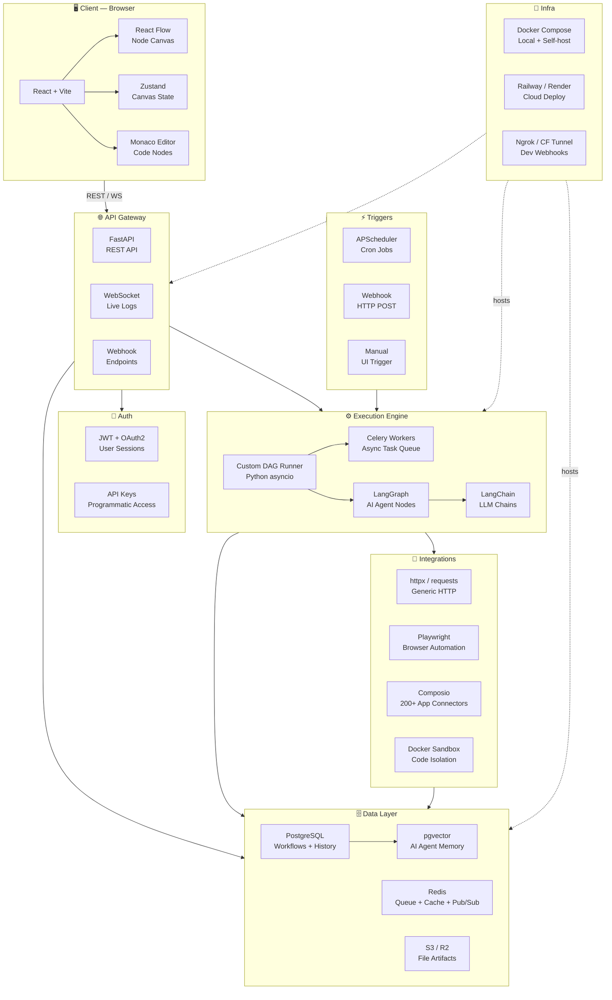
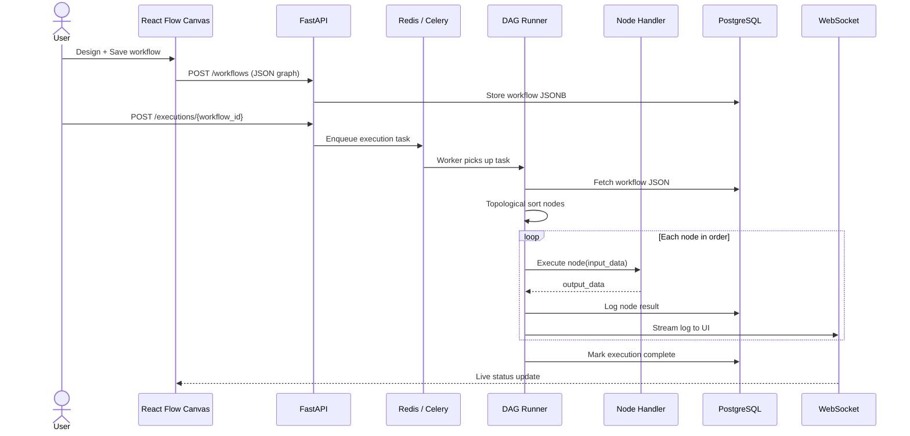
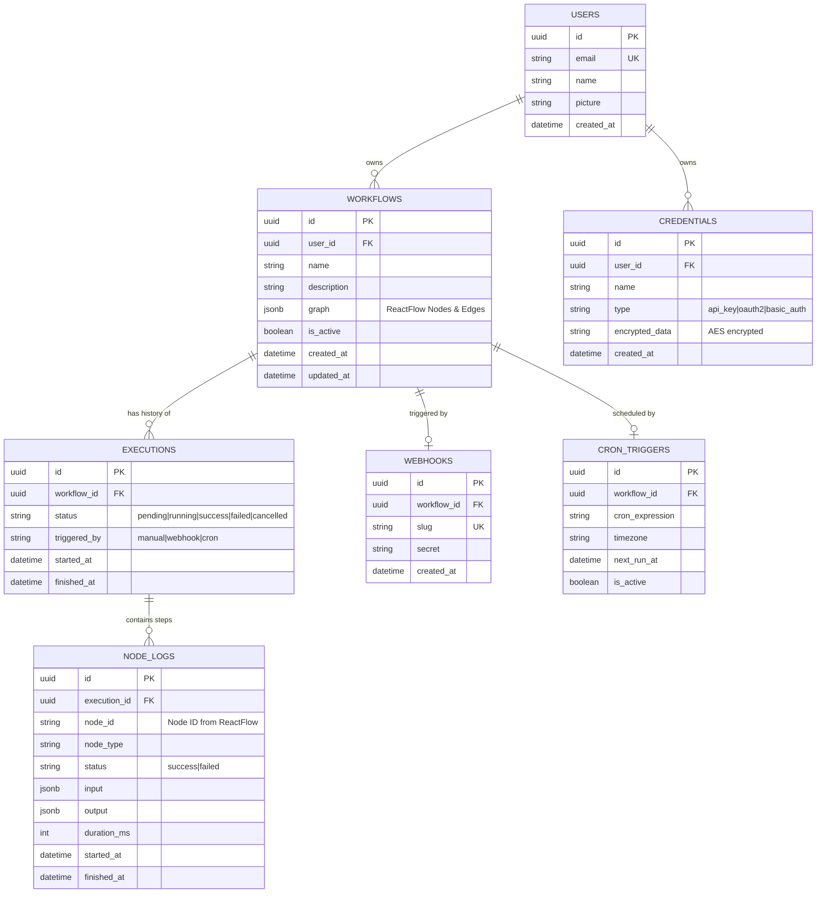

# Noderift — Design & Architecture

> Workflow automation platform (n8n-like). Visual node editor + DAG execution engine + AI agent nodes.

---

## 1. High-Level Architecture



---

## 2. Data Flow — Workflow Execution



---

## 3. Directory Structure

```
noderift/
├── frontend/                  # React + Vite app
│   ├── src/
│   │   ├── components/
│   │   │   ├── canvas/        # React Flow wrappers
│   │   │   ├── nodes/         # Custom node types
│   │   │   ├── sidebar/       # Node palette
│   │   │   └── panels/        # Config panels
│   │   ├── store/             # Zustand state slices
│   │   ├── hooks/             # useExecution, useWebSocket
│   │   └── pages/             # Dashboard, Editor, History
│   └── vite.config.ts
│
├── backend/                   # FastAPI app
│   ├── api/
│   │   ├── routes/
│   │   │   ├── workflows.py   # CRUD
│   │   │   ├── executions.py  # Trigger + status
│   │   │   ├── webhooks.py    # Inbound webhook triggers
│   │   │   └── auth.py        # Login, API keys
│   │   └── deps.py            # DB session, auth deps
│   ├── models/                # SQLAlchemy models
│   ├── schemas/               # Pydantic request/response
│   ├── core/
│   │   ├── dag_runner.py      # DAG executor (asyncio)
│   │   ├── celery_app.py      # Celery + Redis config
│   │   └── scheduler.py      # APScheduler cron triggers
│   ├── nodes/                 # Node handler registry
│   │   ├── base.py            # BaseNode abstract class
│   │   ├── http_node.py
│   │   ├── code_node.py
│   │   ├── ai_agent_node.py   # LangGraph entry point
│   │   └── webhook_node.py
│   ├── integrations/
│   │   ├── composio_client.py
│   │   └── docker_sandbox.py
│   └── migrations/            # Alembic
│
├── worker/                    # Celery worker entrypoint
├── docker-compose.yml
├── docker-compose.prod.yml
└── .env.example
```

---

## 4. Tech Stack Reference

### Layer 1 — Canvas UI

| Tech | Role | Notes |
|------|------|-------|
| **React Flow** ✓ | Node canvas, edges, drag-drop, zoom/pan | `@xyflow/react` |
| **React + Vite** | Frontend framework + dev bundler | Alt: Next.js for SSR |
| **Zustand** | Canvas state — nodes, edges, selections | Alt: Jotai |
| **Tailwind CSS** | Styling — nodes, sidebar, panels | Alt: shadcn/ui |
| **Monaco Editor** | Code node editor with syntax highlight | Same engine as VS Code |

### Layer 2 — Backend API

| Tech | Role | Notes |
|------|------|-------|
| **FastAPI** ✓ | REST API — workflow CRUD, execution trigger | Alt: Express/Hono |
| **PostgreSQL** | Store workflows, credentials, execution history | Workflows in JSONB col |
| **SQLAlchemy + Alembic** | ORM + migrations | Alt: Prisma (Node) |
| **JWT + OAuth2** | Auth — user sessions + API keys | Alt: Clerk / Auth0 |
| **Redis** | Execution queue, caching, pub/sub logs | Required for async |

### Layer 3 — Execution Engine

> ⚠️ **Hardest layer.** Noderift's core is a DAG executor — reads node graph, runs nodes in dependency order, passes data downstream. Built in Python asyncio.

| Tech | Role | Notes |
|------|------|-------|
| **Custom DAG Runner** ✓ | Read workflow JSON → execute in topological order | Python asyncio |
| **Celery + Redis** | Background task queue for executions | Alt: ARQ, RQ |
| **LangGraph** ✓ | AI agent nodes — reasoning, tool use, memory | Sub-workflow agent |
| **LangChain** | LLM integrations + prompt chains | Works with LangGraph |
| **Temporal.io** | Durable long-running workflows + retries | Alt: Prefect, Airflow |

### Layer 4 — Node Integrations

| Tech | Role | Notes |
|------|------|-------|
| **httpx / requests** | Generic HTTP node for any REST API | Core of 80% of nodes |
| **Playwright** | Browser automation node — scraping, clicking | Alt: Puppeteer |
| **Composio** | 200+ pre-built OAuth connectors | Gmail, Slack, Sheets |
| **Pydantic** | Node I/O schema validation | Type safety |
| **Docker sandbox** | Isolate user code nodes | Alt: Firecracker |

### Layer 5 — Triggers

| Tech | Role | Notes |
|------|------|-------|
| **APScheduler** | Cron / timed triggers | Alt: Celery Beat |
| **Webhook endpoints** | HTTP POST trigger per workflow | FastAPI route |
| **WebSockets / SSE** | Stream live logs to UI | FastAPI native |
| **Ngrok / CF Tunnel** | Expose local webhooks during dev | Dev only |

### Layer 6 — Infra & Deployment

| Tech | Role | Notes |
|------|------|-------|
| **Docker + Compose** | Self-host packaging | Essential for OSS release |
| **Railway / Render** | Managed cloud for early stage | Alt: AWS ECS, GCP Run |
| **pgvector** | Vector memory for AI agents | Postgres extension |
| **S3 / Cloudflare R2** | Execution artifacts + file outputs | R2 = free egress |

---

## 5. Database Schema (Core Tables)

```sql
-- Users
users (id, email, hashed_password, created_at)

-- Workflows
workflows (
  id, user_id, name, description,
  graph JSONB,          -- { nodes: [], edges: [] }
  is_active BOOL,
  created_at, updated_at
)

-- Executions
executions (
  id, workflow_id, triggered_by,  -- manual | webhook | cron
  status,                          -- pending | running | success | failed
  started_at, finished_at,
  error TEXT
)

-- Execution logs (per node)
execution_logs (
  id, execution_id, node_id,
  input JSONB, output JSONB,
  status, started_at, finished_at, error
)

-- Credentials (encrypted)
credentials (id, user_id, name, type, encrypted_data, created_at)

-- Webhook registrations
webhook_triggers (id, workflow_id, path_slug, secret, created_at)

-- Cron triggers
cron_triggers (id, workflow_id, cron_expression, next_run_at, is_active)
```

---

## 6. Node System Design

Every node in Noderift is a Python class inheriting from `BaseNode`:

```python
# backend/nodes/base.py
from abc import ABC, abstractmethod
from pydantic import BaseModel
from typing import Any

class NodeInput(BaseModel):
    data: dict[str, Any]

class NodeOutput(BaseModel):
    data: dict[str, Any]

class BaseNode(ABC):
    node_type: str          # e.g. "http_request"
    display_name: str       # e.g. "HTTP Request"
    description: str
    input_schema: type[BaseModel]
    output_schema: type[BaseModel]

    @abstractmethod
    async def execute(self, inputs: NodeInput, config: dict) -> NodeOutput:
        ...
```

Node registry maps `node_type` strings to classes — DAG runner resolves them at execution time.

---

## 7. Phased Implementation Plan

### Phase 1 — Foundation (Week 1–2)
**Goal:** Repo setup, auth, basic CRUD

- ✅ Init monorepo: `frontend/` + `backend/`
- ✅ Docker Compose: Postgres + Redis + API + Frontend
- ✅ FastAPI skeleton: health check, CORS, error handlers
- ✅ SQLAlchemy models: `users`, `workflows`
- ✅ Alembic migrations
- ✅ Auth: JWT login + register endpoints
- ✅ `GET/POST/PUT/DELETE /workflows` CRUD
- ✅ React + Vite init with Tailwind
- ✅ Login / register UI pages
- ✅ Dashboard page (list workflows)

**Deliverable:** Login works. You can create/list/delete workflows via API.

---

### Phase 2 — Canvas UI (Week 3–4)
**Goal:** Visual node editor working in browser

- [x] Install `@xyflow/react`
- [x] Canvas page with drag-drop nodes
- [ ] Zustand store: `useWorkflowStore` (nodes, edges)
- [x] Node palette sidebar (searchable)
- [x] Custom node component (input/output handles, label)
- [x] Edge connection logic
- [x] Config panel — click node → see settings form
- [x] Save workflow graph (serialize to JSON → POST to API)
- [x] Load workflow from API → render on canvas
- [ ] Monaco Editor embedded in Code node config

**Deliverable:** Designer can visually build a node graph and save/load it.

---

### Phase 3 — Execution Engine (Week 5–7)
**Goal:** Workflows actually run

- [ ] DAG runner: topological sort with `asyncio`
- [ ] `executions` + `execution_logs` DB tables
- [ ] `POST /executions/{workflow_id}` → enqueue task
- [ ] Celery + Redis worker setup
- [ ] BaseNode abstract class + node registry
- [ ] First real node: `HttpRequestNode` (httpx)
- [ ] Second node: `CodeNode` (exec in Docker sandbox)
- [ ] WebSocket endpoint: `/ws/executions/{id}/logs`
- [ ] Frontend execution panel: live log stream
- [ ] Execution history page

**Deliverable:** User builds HTTP → Code node chain, runs it, sees live logs.

---

### Phase 4 — Triggers (Week 8)
**Goal:** Workflows start automatically

- [ ] Webhook trigger: `POST /webhooks/{slug}` → fires workflow
- [ ] Webhook registration UI + copy URL
- [ ] APScheduler cron trigger service
- [ ] Cron config UI (expression picker)
- [ ] Manual trigger button on canvas
- [ ] Ngrok integration for local dev webhook testing

**Deliverable:** Workflow runs on schedule OR when external service hits webhook URL.

---

### Phase 5 — Integrations (Week 9–10)
**Goal:** Real-world connectors

- [ ] Composio OAuth integration (Gmail, Slack, Sheets, Notion)
- [ ] Credential vault (encrypted storage in DB)
- [ ] Credential selector in node config panel
- [ ] `PlaywrightNode` for browser automation
- [ ] Node library expanded: Filter, Merge, Loop, Set Variable
- [ ] Pydantic validation on all node I/O schemas
- [ ] Node testing: run single node with mock input

**Deliverable:** User can build "Gmail → filter → Slack notify" workflow.

---

### Phase 6 — AI Agent Nodes (Week 11–12)
**Goal:** LangGraph AI agents as first-class nodes

- [ ] `AiAgentNode` wrapping LangGraph `StateGraph`
- [ ] LangChain tool definitions for each integration
- [ ] Agent memory with pgvector (persistent across executions)
- [ ] LLM config: model selector, system prompt, temperature
- [ ] Sub-workflow: AI agent node can call other Noderift nodes as tools
- [ ] Streaming agent reasoning to WebSocket log panel
- [ ] Supported LLMs: OpenAI, Anthropic, Groq (via LangChain)

**Deliverable:** User drops an AI Agent node → it autonomously calls tools and passes results downstream.

---

### Phase 7 — Production Hardening (Week 13–14)
**Goal:** Ready for real users

- [ ] Rate limiting (slowapi)
- [ ] Execution timeout + kill signal to Celery workers
- [ ] Retry logic: node-level retries with backoff
- [ ] Error handling: node failure → partial execution log
- [ ] Secrets manager (environment-based, not hardcoded)
- [ ] Multi-tenant isolation: users only see their workflows
- [ ] API key auth for programmatic trigger
- [ ] Audit log table
- [ ] Health check + readiness endpoints
- [ ] Prometheus metrics (optional)

---

### Phase 8 — Production Hardening (Week 15)
**Goal:** Battle-ready for real users at scale

> ⚠️ **Deployment is NOT a final phase.** Every phase ships to Render from day 1. Phase 1 deploys a single health-check endpoint. Each phase adds to the live service. See `api.md` for deploy-first workflow.

- [ ] Rate limiting (slowapi)
- [ ] Execution timeout + kill signal to Celery workers
- [ ] Retry logic: node-level retries with backoff
- [ ] Error handling: node failure → partial execution log
- [ ] Secrets manager (environment-based, not hardcoded)
- [ ] Multi-tenant isolation: users only see their workflows
- [ ] API key auth for programmatic trigger
- [ ] Audit log table
- [ ] Prometheus metrics (optional)
- [ ] `docker-compose.prod.yml` finalized
- [ ] S3 / Cloudflare R2 for artifact storage
- [ ] Basic smoke test suite (pytest + httpx)
- [ ] README with self-host instructions

**Deliverable:** `https://noderift.app` is production-hardened and stable.

---

## 8. Key Design Decisions

| Decision | Choice | Why |
|----------|--------|-----|
| Frontend framework | React + Vite | Fastest dev loop; React Flow requires React |
| Backend language | Python | LangGraph/LangChain ecosystem; asyncio for DAG |
| DAG execution | Custom Python asyncio runner | Full control over node data passing |
| Task queue | Celery + Redis | Mature, battle-tested, Python-native |
| AI agent framework | LangGraph | Stateful agents, tool calling, memory |
| Pre-built connectors | Composio | Saves 3–6 months of OAuth plumbing |
| Code isolation | Docker sandbox | Security — user code must not touch host |
| Auth | JWT + OAuth2 (FastAPI built-in) | No external dependency for v1 |
| DB | PostgreSQL + JSONB | Flexible workflow graph storage + relations |
| Vector memory | pgvector | No second DB needed |

---

## 9. Recommended Build Order

> 🚀 **Deploy-first principle:** Phase 1 ships a live `/health` endpoint to Render. Every subsequent phase is deployed incrementally. No big-bang launch.

```
Step 1 → FastAPI skeleton  →  Deploy to Render  →  Step 2 → Models + Auth
       →  Deploy  →  Step 3 → Workflows CRUD  →  Deploy
       →  Phase 2 → Canvas UI  →  Phase 3 → DAG Engine
       →  Phase 4 → Triggers  →  Phase 5 → Integrations
       →  Phase 6 → AI Nodes  →  Phase 8 → Harden
```

See [`api.md`](./api.md) for the full FastAPI endpoint reference used across all phases.

---

## 10. Database Schema Design


