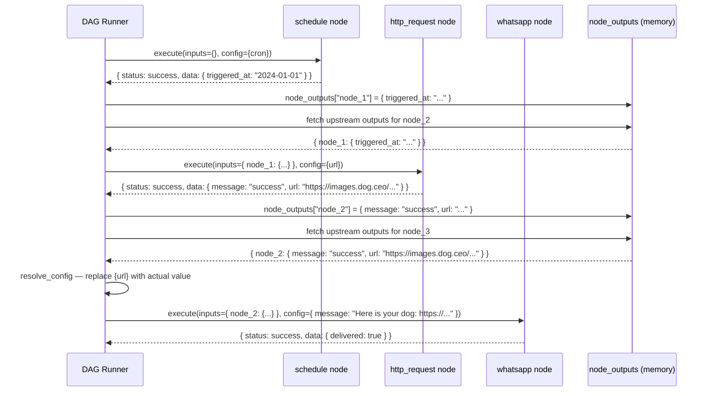
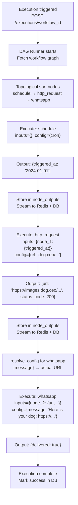

# Noderift — Node Data Passing & Variable Interpolation

> How Noderift passes the output of every node as the input to the next — making workflows truly end-to-end connected, not just visually linked.

---

## 1. Problem Statement

Right now Noderift's DAG runner executes nodes in topological order — but each node runs in isolation. It has no access to what the previous node returned.

This means a workflow like:

```
schedule → http_request → whatsapp
```

...looks connected on the canvas but isn't actually connected at runtime. The WhatsApp node can't use the image URL that the HTTP node fetched. It just runs with whatever static config was saved — `{image_url}` stays as a literal string, never replaced.

This breaks the entire point of workflow automation. **Nodes must be able to consume the outputs of their upstream nodes.**

### What's missing

| What exists today | What's missing |
|-------------------|----------------|
| DAG topological sort | Passing output of node N as input to node N+1 |
| Node outputs stored in memory, Redis, DB | Injecting those outputs into downstream node config |
| Static node config (url, message, etc.) | Variable interpolation — `{url}` → actual value |
| Each node runs independently | Nodes knowing what upstream nodes returned |

### Concrete example of the broken state

The AI Planner builds this workflow correctly:

```json
{
  "nodes": [
    { "id": "node_1", "type": "schedule", "config": { "cron": "0 0 * * *" } },
    { "id": "node_2", "type": "http_request", "config": { "url": "https://dog.ceo/api/breeds/image/random" } },
    { "id": "node_3", "type": "whatsapp", "config": { "message": "Here is your dog: {message}" } }
  ],
  "edges": [
    { "source": "node_1", "target": "node_2" },
    { "source": "node_2", "target": "node_3" }
  ]
}
```

At execution time, `node_3` runs with `message = "Here is your dog: {message}"` — the placeholder is never resolved. The WhatsApp message goes out broken.

---

## 2. How It Should Work



---

## 3. Solution Overview

Three changes make this work:

**1. Standardize output shape** — every node returns the same envelope so downstream nodes always know where to find data.

**2. Inject upstream outputs into each node** — DAG runner collects `node_outputs[parent_id]` for all parents before calling `execute()`.

**3. Variable interpolation** — before executing a node, resolve any `{variable}` placeholders in its config against the upstream outputs.

---

## 4. Step 1 — Standardize Node Output Shape

Every node must return this exact envelope. No exceptions.

```python
# backend/nodes/base.py

from pydantic import BaseModel
from typing import Any

class NodeOutput(BaseModel):
    status: str          # "success" | "failed"
    data: dict[str, Any] # actual output — anything downstream nodes need
    error: str | None = None
```

**Why this matters:** downstream nodes and the DAG runner need a predictable structure. If `http_request` returns raw JSON and `code` returns a string, the interpolation system can't reliably find values.

### Output contract per node type

| Node | What `data` must contain |
|------|--------------------------|
| `schedule` | `{ "triggered_at": "ISO timestamp" }` |
| `http_request` | Full response body JSON + `{ "status_code": 200 }` |
| `code` | Whatever the script returns via `return` statement |
| `whatsapp` | `{ "delivered": true, "message_id": "..." }` |
| `resend` | `{ "delivered": true, "email_id": "..." }` |
| `filter` | `{ "passed": true/false, "data": { ...input } }` |
| `webhook` | Full webhook payload |
| `ai_agent` | `{ "response": "...", "tool_calls": [...] }` |

---

## 5. Step 2 — Inject Upstream Outputs into Each Node

The DAG runner already does topological sort. Before calling `node.execute()`, collect all parent outputs from `node_outputs` and pass them as `inputs`.

```python
# backend/core/dag_runner.py

async def execute_node(
    node: BaseNode,
    node_outputs: dict,      # accumulated outputs from all completed nodes
    graph_edges: list,       # all edges in the workflow
    execution_id: str,
    db: AsyncSession,
    redis: Redis,
) -> NodeOutput:

    # Step 1 — collect outputs from all upstream nodes
    parent_ids = get_parent_ids(node.id, graph_edges)
    upstream_data = {
        parent_id: node_outputs[parent_id]["data"]
        for parent_id in parent_ids
        if parent_id in node_outputs
    }

    # Step 2 — resolve {variables} in config before executing
    resolved_config = resolve_config(node.config, upstream_data)

    # Step 3 — execute node with upstream context
    result = await node.execute(
        inputs=upstream_data,       # full upstream data available inside node
        config=resolved_config,     # config with placeholders filled in
    )

    # Step 4 — store output for downstream nodes
    node_outputs[node.id] = result.dict()

    # Step 5 — persist to DB + stream to UI (already implemented)
    await save_node_log(execution_id, node.id, resolved_config, result, db)
    await stream_to_redis(execution_id, node.id, result, redis)

    return result


def get_parent_ids(node_id: str, edges: list) -> list[str]:
    """Find all nodes that have an edge pointing to this node."""
    return [edge["source"] for edge in edges if edge["target"] == node_id]
```

---

## 6. Step 3 — Variable Interpolation (`resolve_config`)

This is the heart of the feature. Before a node executes, scan its config for `{variable}` placeholders and replace them with actual values from upstream outputs.

```python
# backend/core/resolver.py

import json
import re

def resolve_config(config: dict, upstream_data: dict) -> dict:
    """
    Replace {variable} placeholders in node config with values
    from upstream node outputs.

    upstream_data shape:
    {
        "node_abc": { "url": "https://...", "status_code": 200 },
        "node_xyz": { "triggered_at": "2024-01-01T00:00:00Z" }
    }
    """
    config_str = json.dumps(config)

    # flatten all upstream outputs into one lookup dict
    # later nodes override earlier ones if keys collide
    variables = {}
    for parent_id, data in upstream_data.items():
        variables.update(_flatten(data))

    # replace all {key} occurrences
    def replace_match(match):
        key = match.group(1)
        return str(variables.get(key, match.group(0)))  # leave unreplaced if not found

    resolved_str = re.sub(r"\{(\w+)\}", replace_match, config_str)

    return json.loads(resolved_str)


def _flatten(data: dict, prefix: str = "") -> dict:
    """
    Flatten nested dict for dot-notation access.
    { "dog": { "url": "https://..." } } → { "dog.url": "https://...", "url": "https://..." }
    Top-level keys are also included without prefix for convenience.
    """
    result = {}
    for key, value in data.items():
        full_key = f"{prefix}.{key}" if prefix else key
        result[full_key] = value
        result[key] = value  # also available without prefix
        if isinstance(value, dict):
            result.update(_flatten(value, full_key))
    return result
```

### How interpolation works in practice

HTTP node returns:
```json
{
  "status": "success",
  "data": {
    "message": "success",
    "url": "https://images.dog.ceo/breeds/hound/n02085936_2032.jpg"
  }
}
```

WhatsApp node config before resolution:
```json
{
  "to": "+1234567890",
  "message": "Good morning! Here is your dog: {url}"
}
```

After `resolve_config`:
```json
{
  "to": "+1234567890",
  "message": "Good morning! Here is your dog: https://images.dog.ceo/breeds/hound/n02085936_2032.jpg"
}
```

### Supported placeholder patterns

| Placeholder | Resolves to |
|-------------|------------|
| `{url}` | Top-level `url` key from any upstream output |
| `{message}` | Top-level `message` key |
| `{dog.url}` | Nested — `data.dog.url` |
| `{triggered_at}` | From schedule node output |
| `{response}` | From AI agent node output |

---

## 7. Step 4 — Update Each Node Handler

Every node handler gets updated to accept `inputs` and call `resolve_config` at the top of `execute()`.

### BaseNode (updated signature)

```python
# backend/nodes/base.py

from abc import ABC, abstractmethod
from typing import Any

class BaseNode(ABC):
    node_type: str
    display_name: str
    description: str

    def __init__(self, node_id: str, config: dict):
        self.id = node_id
        self.config = config

    @abstractmethod
    async def execute(
        self,
        inputs: dict[str, Any],   # upstream node outputs, keyed by node_id
        config: dict,             # already-resolved config (placeholders filled)
    ) -> dict:
        """Execute the node. Return { status, data } envelope."""
        ...
```

### HttpRequestNode

```python
# backend/nodes/http_node.py

import httpx
from .base import BaseNode

class HttpRequestNode(BaseNode):
    node_type = "http_request"
    display_name = "HTTP Request"
    description = "Make an HTTP request to any external API"

    async def execute(self, inputs: dict, config: dict) -> dict:
        # config is already resolved — {variables} already replaced
        async with httpx.AsyncClient() as client:
            response = await client.request(
                method=config.get("method", "GET"),
                url=config["url"],
                headers=config.get("headers", {}),
                json=config.get("body") or None,
            )
            body = response.json()

        return {
            "status": "success",
            "data": {
                **body,                            # full response body
                "status_code": response.status_code,
            }
        }
```

### WhatsAppNode

```python
# backend/nodes/whatsapp_node.py

from twilio.rest import Client
from .base import BaseNode

class WhatsAppNode(BaseNode):
    node_type = "whatsapp"
    display_name = "WhatsApp"
    description = "Send a WhatsApp message"

    async def execute(self, inputs: dict, config: dict) -> dict:
        # config["message"] already has {url} resolved by DAG runner
        client = Client(TWILIO_SID, TWILIO_TOKEN)
        message = client.messages.create(
            from_="whatsapp:+14155238886",
            to=f"whatsapp:{config['to']}",
            body=config["message"],   # ← resolved value used here
        )

        return {
            "status": "success",
            "data": {
                "delivered": True,
                "message_id": message.sid,
            }
        }
```

---

## 8. Step 5 — Persist Resolved Input to node_logs

Save the **resolved** config (after interpolation) to `node_logs.input`, not the raw template. This way the execution history shows exactly what ran.

```python
# backend/core/dag_runner.py

await db.execute(
    insert(NodeLog).values(
        execution_id=execution_id,
        node_id=node.id,
        node_type=node.node_type,
        input=resolved_config,      # ← resolved, not raw template
        output=result["data"],
        status=result["status"],
        started_at=started_at,
        finished_at=datetime.utcnow(),
    )
)
```

---

## 9. Full End-to-End Execution Flow



---

## 10. Files to Change

| File | Change |
|------|--------|
| `backend/nodes/base.py` | Update `execute()` signature — add `inputs` param |
| `backend/core/dag_runner.py` | Collect upstream outputs + call `resolve_config` before each node |
| `backend/core/resolver.py` | New file — `resolve_config()` + `_flatten()` |
| `backend/nodes/http_node.py` | Accept `inputs`, use resolved `config` |
| `backend/nodes/whatsapp_node.py` | Accept `inputs`, use resolved `config` |
| `backend/nodes/resend_node.py` | Accept `inputs`, use resolved `config` |
| `backend/nodes/code_node.py` | Accept `inputs`, expose them as variables inside script |
| `backend/nodes/ai_agent_node.py` | Accept `inputs`, inject upstream data into agent context |

---

## 11. Implementation Order

### Step 1 — resolver.py
Write and unit test `resolve_config()` in isolation. Test with hardcoded upstream data and config templates before touching the DAG runner.

```python
# quick test
upstream = {"node_2": {"url": "https://images.dog.ceo/test.jpg", "status_code": 200}}
config = {"message": "Here is your dog: {url}"}
assert resolve_config(config, upstream)["message"] == "Here is your dog: https://images.dog.ceo/test.jpg"
```

### Step 2 — BaseNode signature
Update `execute()` to accept `inputs: dict` as first param. Update all existing node handlers to match — even if they ignore `inputs` for now.

### Step 3 — DAG runner
Add `get_parent_ids()`, upstream collection, and `resolve_config()` call before each `node.execute()`. This is the core change.

### Step 4 — Node handlers
Update `http_node`, `whatsapp_node`, `resend_node` to use resolved config. Test each individually.

### Step 5 — End-to-end test
Run the dog workflow: schedule → http_request → whatsapp. Verify WhatsApp message contains the actual dog image URL, not `{url}`.

---

## 12. Key Design Decisions

| Decision | Choice | Why |
|----------|--------|-----|
| Output envelope | `{ status, data }` on every node | Predictable shape — interpolation always knows where values live |
| Interpolation timing | DAG runner resolves before calling `execute()` | Node handlers stay clean — they never see raw templates |
| Flattening nested keys | Both `{url}` and `{dog.url}` work | Convenience — AI Planner doesn't need to know nesting depth |
| Unresolved placeholders | Left as-is, not errored | Graceful degradation — partial data shouldn't kill the whole execution |
| Persist resolved config | Save resolved input to `node_logs.input` | History shows what actually ran, not the template |
| `inputs` param on execute | Full upstream dict, keyed by node_id | Code nodes and AI agent nodes can access the full upstream context, not just interpolated strings |
